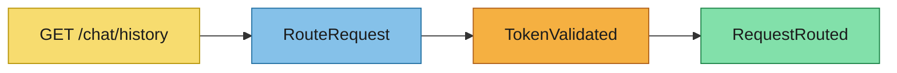
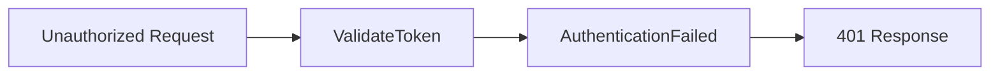
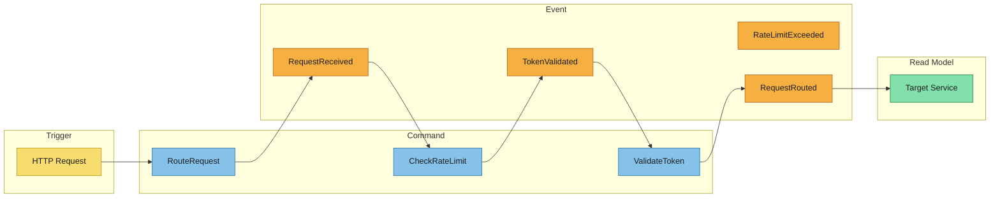

# Event Modeling

Convert event-storming outputs into explicit behavior flows for the API Gateway.

## Scenario Overview
- **Scenario**: Successful Authorized Routing
- **Business objective**: Ensure a valid request is forwarded to the correct microservice.
- **Source references from `event-storming.md`**: `RequestReceived`, `TokenValidated`, `RequestRouted`.

## Swim Lanes

### Trigger
- **Human/system trigger**: Client (Mobile App) sends GET request to `/api/v1/chat/history`.
- **Input signal**: HTTP Request with `Authorization: Bearer <token>`.

### Command
- **Command name**: `RouteRequest`
- **Target aggregate/context**: Gateway
- **Validation rules**:
  - Path must match a known service route.
  - JWT must be present and well-formed.

### Event
- **Event name**: `TokenValidated` -> `RequestRouted`
- **Event payload summary**: `{ user_id: "u123", service: "chat-service", path: "/history" }`
- **Ordering/idempotency notes**: Sequential within the request lifecycle.

### Read Model
- **Projection or materialized view**: `routing_table` (internal lookup)
- **Consumer(s)**: Gateway Routing Engine
- **Query/use-case enabled**: Forwarding traffic to internal service IPs.

## Mermaid Flow

---

## Scenario Overview
- **Scenario**: Unauthorized Access Prevention
- **Business objective**: Block requests with invalid or missing credentials.
- **Source references from `event-storming.md`**: `AuthenticationFailed`.

## Swim Lanes

### Trigger
- **Human/system trigger**: Unauthorized Client
- **Input signal**: HTTP Request with expired JWT.

### Command
- **Command name**: `ValidateToken`
- **Target aggregate/context**: Auth Context
- **Validation rules**: Token must be signed by valid issuer and not expired.

### Event
- **Event name**: `AuthenticationFailed`
- **Event payload summary**: `{ reason: "expired", client_ip: "1.2.3.4" }`
- **Ordering/idempotency notes**: Terminal event for the request.

### Read Model
- **Projection or materialized view**: None (Direct 401 response)
- **Consumer(s)**: Client
- **Query/use-case enabled**: Security logging.

## Mermaid Flow

---

## Timeline / Swimlane Diagram

## Derivation Notes for Downstream Artifacts
- **Specs inputs**: Define exact path-to-service mapping (e.g., `/api/v1/auth` -> `auth-service:8080`).
- **Design inputs**: Select Nginx/Kong configuration style. Define how auth-service is called (sidecar vs. direct).
- **AsyncAPI inputs**: Define events like `RateLimitExceeded` to be published to a `gateway.events` topic for analytics.
