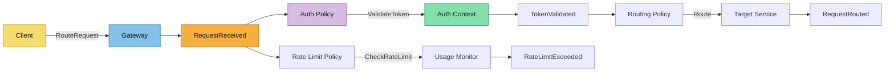

# Event Storming

Capture collaborative discovery outcomes for the API Gateway routing domain.

## Scope and Goal
- **Domain/problem area**: API Gateway (Entry point for all external traffic)
- **Desired business outcome**: Secure, reliable, and performant routing of client requests to backend microservices.
- **In/out of scope**:
  - In: Path-based routing, JWT verification (via auth-service), rate limiting.
  - Out: Business logic of downstream services, complex payload transformation.

## Actors
- **Primary users**: Web/Mobile Client Applications
- **External systems**: Downstream Microservices (Chat, Booking, Doctor, Auth, etc.)
- **Automated agents**: Rate Limiter, Auth Filter

## Domain Events (Past Tense)
- **RequestReceived**:
  - Trigger/why it happened: Client made an HTTP request to the gateway.
  - Data emitted: Method, Path, Headers, IP.
  - Business impact: Entry point for billing/tracking.
- **TokenValidated**:
  - Trigger/why it happened: Gateway successfully verified the JWT token.
  - Data emitted: UserID, Roles.
  - Business impact: User is authorized to proceed.
- **AuthenticationFailed**:
  - Trigger/why it happened: Invalid or missing JWT token.
  - Data emitted: Error code, Client IP.
  - Business impact: Unauthorized access prevented.
- **RateLimitExceeded**:
  - Trigger/why it happened: Client exceeded the allowed number of requests per minute.
  - Data emitted: Client IP, Limit.
  - Business impact: Protects backend from DDoS/Overload.
- **RequestRouted**:
  - Trigger/why it happened: Request forwarded to the target microservice.
  - Data emitted: Target Service, Latency.
  - Business impact: Core functionality delivered.
- **RoutingFailed**:
  - Trigger/why it happened: Target service unavailable or path not found.
  - Data emitted: 404/503 status.
  - Business impact: User experiences service interruption.

## Commands
- **RouteRequest**:
  - Issuer (actor/system): Client / Gateway Core
  - Aggregate/context target: Gateway
  - Preconditions: None (initial entry)
  - Expected event(s): RequestReceived, RequestRouted
- **ValidateToken**:
  - Issuer (actor/system): Gateway Auth Filter
  - Aggregate/context target: Auth Context
  - Preconditions: JWT present in headers
  - Expected event(s): TokenValidated, AuthenticationFailed
- **CheckRateLimit**:
  - Issuer (actor/system): Gateway Rate Limiter
  - Aggregate/context target: Usage Monitor
  - Preconditions: RequestReceived
  - Expected event(s): RateLimitExceeded (if over limit)

## Aggregates / Bounded Contexts
- **Gateway**:
  - Responsibilities: Routing, Auth Enforcement, Rate Limiting.
  - Invariants: No request reaches a protected microservice without valid auth.
  - Owned data: Routing table, Rate limit counters (Redis-backed).

## Automations / Policies
- **Auth Enforcement Policy**:
  - Triggering event: RequestReceived
  - Command emitted: ValidateToken
  - Failure handling: Return 401 Unauthorized
- **Rate Limit Policy**:
  - Triggering event: RequestReceived
  - Command emitted: CheckRateLimit
  - Failure handling: Return 429 Too Many Requests

## Timeline Diagram (Mermaid)

## Hotspots and Open Questions
- **Ambiguity**: Should the gateway validate the JWT itself (using a shared secret/public key) or call `auth-service` for every request?
- **Risk**: Single point of failure (Gateway).
- **Decision needed**: Which technology to use (Nginx, Kong, or a Go-based custom gateway)? The PRD mentions "Nginx / Kong".

## Handoff to Next Artifacts
Summarize how these findings should inform:
- `event-modeling.md`: Will detail the sequence of filters and error branches.
- `specs/**/*.md`: Will define exact path mappings and rate limit values.
- `design.md`: Will decide between Nginx vs Kong vs Custom.
- `asyncapi.yaml`: Gateway events (like RateLimitExceeded) might be published to Kafka for `analytics-service`.
